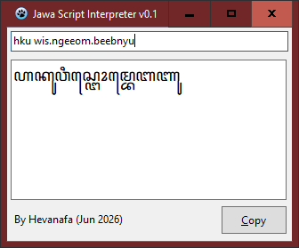
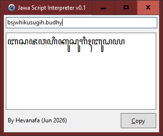

Jawa Script Interpreter (JSI) is a literal input system / DSL for writing Aksara Jawa

It prioritises predictable output over natural Latin readability.  The source text may look unusual, but every token maps directly to an Aksara Jawa letter, sandhangan, pasangan, punctuation, or number

# Examples

`hkuwis.ngeeom.beebnyu`

ꦲꦏꦸꦮꦶꦱ꧀ꦔꦺꦴꦩ꧀ꦧꦺꦧꦚꦸ

"Aku wis ngombé banyu"

`bsjwhikusugih.budhy`

ꦧꦱꦗꦮꦲꦶꦏꦸꦱꦸꦒꦶꦃꦧꦸꦝꦪ

"Basa Jawa iku sugih budhaya"

# Fonts Used

You can use Noto Sans Javanese or any default Javanese fonts to display the Javanese text

# Building

1. Open `project.lpi` with Lazarus IDE (v4.6 by the time of writing)
2. Change the build mode to **release**
3. Build by **Run > Compile** menu or `Ctrl+F9`
